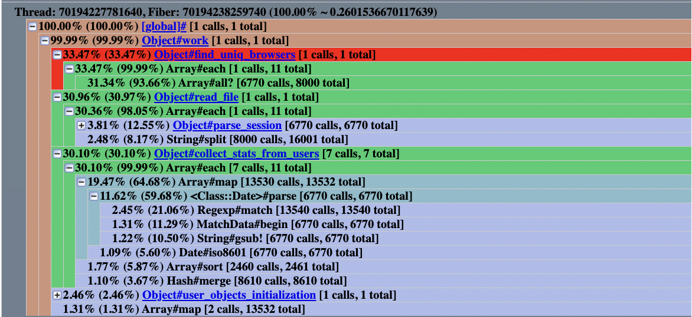
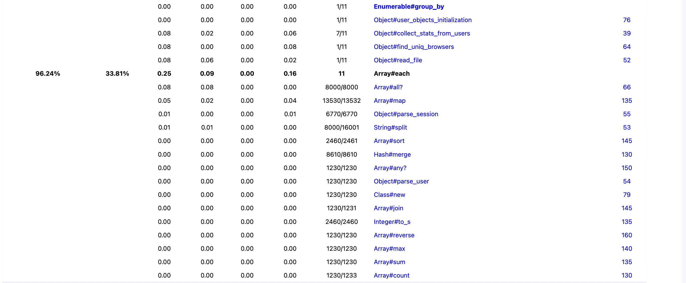
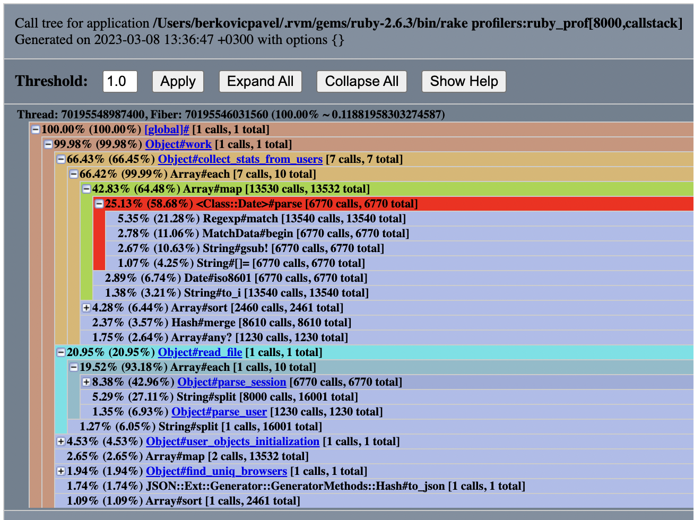
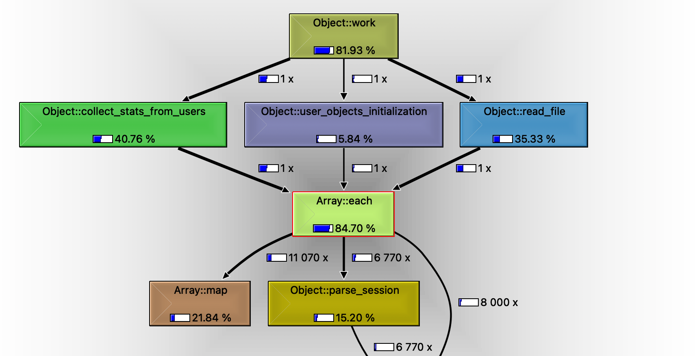
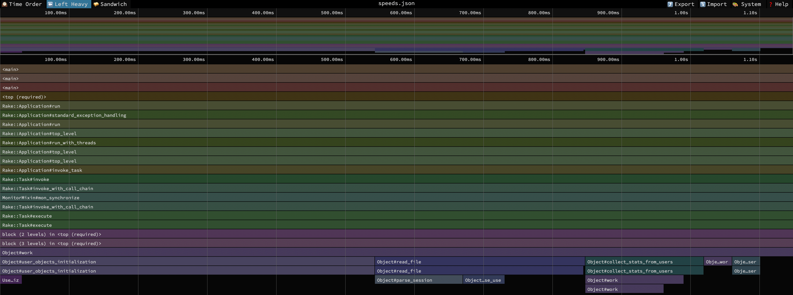
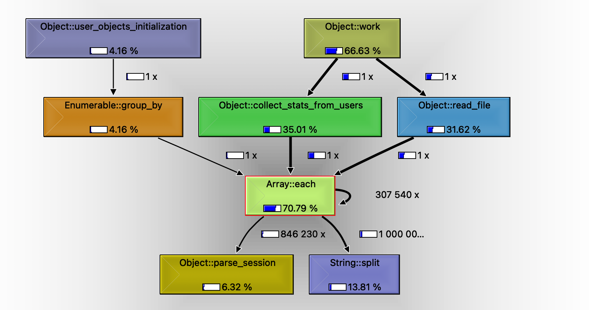

# Case-study оптимизации

## Актуальная проблема
Программа на `ruby`, которая успешно обрабатывала файлы размером несколько мегабайт, работает слишком долго на файле размером чуть больше ста мегабайт, и не ясно, закончит ли она вообще работу за разумное время.

## Подготовительная работа:
1. [Формирование большего количества данных, для более качественного тестирования производительности](https://github.com/berkovichpavel/rails-optimization-task1/pull/1/commits/3f05060acd4578993e7150f875c3f12e74bee8ec)
2. Добавление профилировщиков, для работы с данными:

   [version 1](https://github.com/berkovichpavel/rails-optimization-task1/pull/1/commits/29572af7b58b3697660ee3cca13614b2c1bfdd9b)- в разных файлах, как было показано на курсах.

   [version 2](https://github.com/berkovichpavel/rails-optimization-task1/pull/1/commits/d42b2ce7af1c34f34dffd7f1e5e6051c80a4d346) - с использованием `rake` задач с параметрами.

3. [Добавление benchmark тестрования](https://github.com/berkovichpavel/rails-optimization-task1/pull/1/commits/a81da43879b110ef1a89c79987ce177cadc8f624)
4. Оценка веременной сложности программы:
    
    При запуске benchmark тестирования при момощи команды `ruby scripts/bench_mark_testing.rb`, были получены следующие результаты:
    ```azure
    1000 lines Completed in 0.034 sec
    2000 lines Completed in 0.083 sec
    4000 lines Completed in 0.26 sec
    8000 lines Completed in 0.919 sec
    16000 lines Completed in 3.268 sec
    32000 lines Completed in 14.75 sec
    64000 lines Completed in 65.591 sec
    128000 lines Completed in 305.615 sec
    ```
   Исходя из полученных результатов, можно убедиться, что временная сложность алгоритма O(N^2).

5. [Добаление тестов для предотвращения регресси](https://github.com/berkovichpavel/rails-optimization-task1/pull/1/commits/2506ac9a54cb754af1aec1db77ee8fa7bfda1d17)

## Формирование метрики
Для того, чтобы понимать, дают ли изменения программы положительный эффект на быстродействие программы, использовалась такую метрика, как время работы программы.
Однако использовать весь набор данных `data_large.txt.gz` нецелесообразно, так как программа выполняется очень долго.

**_Решение_**: Использовать ограниченный набор данных и увеличивать его, по мере увелечения скорости выполнения программы.

**_Начальный набор данных_**: 8к строк.

## Бюджет

Обработка файла `data_large.txt.gz` должна быть не более 30 секунд.

## Гарантия корректности работы оптимизированной программы и защита от регрессии
Программа поставлялась с тестом, так же были добалены [тесты на производительность](https://github.com/berkovichpavel/rails-optimization-task1/pull/1/commits/a81da43879b110ef1a89c79987ce177cadc8f624).
Выполнение этих тестов в фидбек-лупе позволяет не допустить изменения логики и регрессии программы при оптимизации.

## Feedback-Loop
Для того, чтобы иметь возможность быстро проверять гипотезы был выставлен эффективный `feedback-loop`, который позволил
получать обратную связь по эффективности сделанных изменений за `2-3` минуты
(без учета пункта 1, описаннного ниже, на него уходило иногда до `20 мин`)

`feedback_loop`:
1. Запустить один или несколько профайлеров(при этом подбирая подходящий набор даных) при помощи rake задач:
   ```
   rake "profilers:ruby_prof[<file_lines>,<profiler>]"
   rake "profilers:stackprof[<file_lines>,<profiler>]"
   
   # Example: rake "profilers:ruby_prof[8000,callstack]"
   ```
2. Найти и исправить проблемный участок кода
3. Проверить помогло ли изменение при промощи benchmark тестирования
4. Убедиться что все тесты проходят успешно
5. Исправить тесты производительности, основываясь на полученных результатах
6. Вернуться к шагу 1

## Вникаем в детали системы, чтобы найти главные точки роста
Для того, чтобы найти 'точки роста' для оптимизации я использовал следующие профилировщики:
- [RubyProf](https://ruby-prof.github.io/)
  - callgrind
  - callstack
  - flat
  - graph
- [Stackprof](https://github.com/tmm1/stackprof)
  - cli
  - speeds

Вот какие проблемы удалось найти и решить:

### Hаходка №1: Вызов select метода для сессий на каждом пользователе
С помощью `RubyProf flat` было выяснено, что `89,59%` времени тратится на `select` метод.

**_Проблема_**:
   ```ruby
    users.each do |user|
      # ...
      user_sessions = sessions.select { |session| session['user_id'] == user['id'] }
      # ...
    end
   ```
**_Решение_**:
  ```ruby
    user_sessions_groups = sessions.group_by { |session| session['user_id'] }
    users.each do |user|
      # ...
      user_sessions = user_sessions_groups[user['id']]
      # ...
    end
  ```
**_Ссылка на коммит_**: [Hаходка №1](https://github.com/berkovichpavel/rails-optimization-task1/pull/1/commits/bff2671d39952aff9ab161f4e6e56ba1d684aa37)

**_Изменение метрики для файла 8000 строк_**: `970 ms -> 200 ms`

### Hаходка №2: Использование пользовательского uniq вместо встроенного
С помощью `RubyProf callstack` было выяснено, что `65,85%` времени тратится на метод `Array#each`.


Так как метод `Array#each`, вызывается довольно часто было принято решение вынести части кода в функции,
для формирования более четкой картины и локализации точки роста:
  ```ruby
    def read_file(file_path)
      file_lines = File.read(file_path).split("\n")

      users = []
      sessions = []

      file_lines.each do |line|
        cols = line.split(',')
        users = users + [parse_user(line)] if cols[0] == 'user'
        sessions = sessions + [parse_session(line)] if cols[0] == 'session'
      end

      [users, sessions]
    end
  ```
  ```ruby
    def find_uniq_browsers(sessions)
      unique_browsers = []
    
      sessions.each do |session|
        browser = session['browser']
        unique_browsers += [browser] if unique_browsers.all? { |b| b != browser }
      end
    end
  ```
  ```ruby
    def find_uniq_browsers(sessions)
      unique_browsers = []
    
      sessions.each do |session|
        browser = session['browser']
        unique_browsers += [browser] if unique_browsers.all? { |b| b != browser }
      end

      unique_browsers
    end
  ```
  ```ruby
    def user_objects_initialization(users, sessions)
      users_objects = []
      sessions_by_user = sessions.group_by { |session| session['user_id'] }
    
      users.each do |user|
        attributes = user
        user_sessions = sessions_by_user[user['id']]
        user_object = User.new(attributes: attributes, sessions: user_sessions)
        users_objects = users_objects + [user_object]
      end
    
      users_objects
    end
  ```

Затем был заново запущен `RubyProf callstack` прифилировщик.



**_Проблема_**:
  ```ruby
    def find_uniq_browsers(sessions)
      unique_browsers = []

      sessions.each do |session|
        browser = session['browser']
        unique_browsers += [browser] if unique_browsers.all? { |b| b != browser }
      end

      unique_browsers
    end
  ```
**_Решение_**:
  ```ruby
    def find_uniq_browsers(sessions)
      sessions.uniq { |session| session['browser'] }
    end
  ```
**_Ссылка на коммит_**: [Hаходка №2](https://github.com/berkovichpavel/rails-optimization-task1/pull/1/commits/d11e8cd8213fbc55f4f44eb2cc39aaf327038d1c)

**_Изменение метрики для файла 8000 строк_**: `200 ms -> 150 ms`

### Hаходка №3: Многократное копирование массива при чтении с файла
С помощью `RubyProf graph` было выяснено, что `33,81%` времени тратится на фунуцию `read_file`, a а именно на метод `Array#each`.



Так как в этой функции нет `Array#each`, было принято решение рассмотреть ее более детально.
Стало заметно, что происходит многократное копирование массива при чтении с файла.

**_Проблема_**:
  ```ruby
    def read_file(file_path)
      # some code
    
      file_lines.each do |line|
        cols = line.split(',')
        users = users + [parse_user(line)] if cols[0] == 'user'
        sessions = sessions + [parse_session(line)] if cols[0] == 'session'
      end

      # some code
    end
  ```
**_Решение_**:
  ```ruby
    def read_file(file_path)
      # some code

      file_lines.each do |line|
        cols = line.split(',')
        users << parse_user(line) if cols[0] == 'user'
        sessions << parse_session(line) if cols[0] == 'session'
      end

      # some code
    end
  ```
**_Ссылка на коммит_**: [Hаходка №3](https://github.com/berkovichpavel/rails-optimization-task1/pull/1/commits/c78f30a9907d9455ffe3d9877fa40618de56c3eb)

**_Изменение метрики для файла 8000 строк_**: `150 ms -> 105 ms`

### Hаходка №4: Ненужный и тяжелый анализ даты
С помощью `RubyProf callstack` было выяснено, что `25,13%` времени тратится на метод `<Class::Date>#parse`.



Был проанализирован входной файл и принято рещение, что нам вовсе не нужен парсинг даты, так как она приходит в нужном нам формате.

**_Проблема_**:
  ```ruby
     { 'dates' => user.sessions.map{ |s| s['date'] }.map { |d| Date.parse(d) }.sort.reverse.map { |d| d.iso8601 } }
  ```
**_Решение_**:
  ```ruby
     { 'dates' => user.sessions.map { |s| s['date'] }.sort.reverse }
    end
  ```
**_Ссылка на коммит_**: [Hаходка №4](https://github.com/berkovichpavel/rails-optimization-task1/pull/1/commits/782e455d3d2af02d1216dc15e48ddd1a3a675fe5)

**_Изменение метрики для файла 8000 строк_**: `105 ms -> 56 ms`

### Hаходка №5: Излишние вызовы метода each из функции `collect_stats_from_users`
С помощью `RubyProf callgrind` было выяснено, что `40,76%` времени тратится на функцию `collect_stats_from_users`.



Проанализировав код, стало понятно, что следует умешьшить количетсво вызовов функции `collect_stats_from_users` и оптимизировать сам вызов.

**_Проблема_**:
  ```ruby
    # Собираем количество сессий по пользователям
    collect_stats_from_users(report, users_objects) do |user|
      { 'sessionsCount' => user.sessions.count }
    end
    
    # Собираем количество времени по пользователям
    collect_stats_from_users(report, users_objects) do |user|
      { 'totalTime' => user.sessions.map {|s| s['time']}.map {|t| t.to_i}.sum.to_s + ' min.' }
    end
    
    # Выбираем самую длинную сессию пользователя
    collect_stats_from_users(report, users_objects) do |user|
      { 'longestSession' => user.sessions.map {|s| s['time']}.map {|t| t.to_i}.max.to_s + ' min.' }
    end
    
    # Браузеры пользователя через запятую
    collect_stats_from_users(report, users_objects) do |user|
      { 'browsers' => user.sessions.map {|s| s['browser']}.map {|b| b.upcase}.sort.join(', ') }
    end
    
    # Хоть раз использовал IE?
    collect_stats_from_users(report, users_objects) do |user|
      { 'usedIE' => user.sessions.map{|s| s['browser']}.any? { |b| b.upcase =~ /INTERNET EXPLORER/ } }
    end
    
    # Всегда использовал только Chrome?
    collect_stats_from_users(report, users_objects) do |user|
      { 'alwaysUsedChrome' => user.sessions.map{|s| s['browser']}.all? { |b| b.upcase =~ /CHROME/ } }
    end
    
    # Даты сессий через запятую в обратном порядке в формате iso8601
    collect_stats_from_users(report, users_objects) do |user|
      { 'dates' => user.sessions.map{|s| s['date']}.map {|d| Date.parse(d)}.sort.reverse.map { |d| d.iso8601 } }
    end
  ```
**_Решение_**:
  ```ruby
    collect_stats_from_users(report, users_objects) do |user|
      user_sessions = user.sessions
      user_browsers = []
      user_times = []
      user_sessions.each do |s|
        user_browsers << s['browser'].upcase
        user_times << s['time'].to_i
      end

      { 
        'sessionsCount' => user_sessions.count, # Собираем количество сессий по пользователям
        'totalTime' => "#{user_times.sum} min.", # Собираем количество времени по пользователям
        'longestSession' => "#{user_times.max} min.", # Выбираем самую длинную сессию пользователя
        'browsers' => user_browsers.sort.join(', '), # Браузеры пользователя через запятую
        'usedIE' => user_browsers.any? { |b| b =~ /INTERNET EXPLORER/ }, # Хоть раз использовал IE?
        'alwaysUsedChrome' => user_browsers.all? { |b| b =~ /CHROME/ }, # Всегда использовал только Chrome?
        # Даты сессий через запятую в обратном порядке в формате iso8601
        'dates' => user_sessions.map { |s| s['date'] }.sort.reverse
      }
    end
  ```
**_Ссылка на коммит_**: [Hаходка №5](https://github.com/berkovichpavel/rails-optimization-task1/pull/1/commits/e3c90eea4d74017c0084d35dcff798f48c91a2be)

**_Изменение метрики для файла 8000 строк_**: `56 ms -> 40 ms`

### Hаходка №6: Излишние корирование массива `user_objects` в функции `user_objects_initialization`
Так как набор данных, состоящий из `8000` сток, уже недосточно эффективен для профилировщиков,
было решено в дальнейщем использовать набор данных из `128 000` сток.

С помощью `Stackprof spedes` было выяснено, что `47%` времени тратится на функцию `user_objects_initialization`.



Проанализировав код, стало понятно, что следует убрать излишнее корирование массива `user_objects` и 
упростить реализацию функции `user_objects_initialization`.

**_Проблема_**:
  ```ruby
    def user_objects_initialization(users, sessions)
      users_objects = []
      sessions_by_user = sessions.group_by { |session| session['user_id'] }

      users.each do |user|
        attributes = user
        user_sessions = sessions_by_user[user['id']]
        user_object = User.new(attributes: attributes, sessions: user_sessions)
        users_objects = users_objects + [user_object]
      end

      users_objects
    end
  ```
**_Решение_**:
  ```ruby
    def user_objects_initialization(users, sessions)
      sessions_by_user = sessions.group_by { |session| session['user_id'] }

      users.map do |user_attributes| 
        User.new(attributes: user_attributes, sessions: sessions_by_user[user_attributes['id']])
      end
    end
  ```
**_Ссылка на коммит_**: [Hаходка №6](https://github.com/berkovichpavel/rails-optimization-task1/pull/1/commits/f77c1cc11ac3ae0e6f015d8fd07531be57dd035c)

**_Изменение метрики для файла 8000 строк_**: `40 ms -> 39 ms`
**_Изменение метрики для файла 128000 строк_**: `1032 ms -> 745 ms`


### Hаходка №7: Излишнее исрользование `String#split`
С помощью `Stackprof cli` и `RubyProf graph` было выяснено, что `25,18%` времени тратится на метод `String#split`.

Проанализировав код, стало понятно, что следует убрать излишнее использование метода `String#split`.

**_Ссылка на коммит_**: [Hаходка №7](https://github.com/berkovichpavel/rails-optimization-task1/pull/1/commits/14c5d4cf6ed914bd37c8ed9bce4eb0eaf63894fe)

**_Изменение метрики для файла 8000 строк_**: `39 ms -> 33 ms`
**_Изменение метрики для файла 128000 строк_**: `745 ms -> 721 ms`


### Hаходка №8: Излишнее копирование объектов
С помощью `RubyProf callgrind` было выяснено, что для набора данных в `1 000 000` строк - `70,78%` времени тратится на метод `Array#each`.



Проанализировав профилилировщик и код, стало понятно, что следует убрать излишнее копирование объектов.

**_Проблема_**:
  ```ruby
    def find_uniq_browsers(sessions)
      sessions.uniq { |session| session['browser'] }
    end

    def work(file_path: 'data/data.txt', disable_gc: false)
      # some code

      report['uniqueBrowsersCount'] = find_uniq_browsers(sessions).count

      report['allBrowsers'] =
        sessions
          .map { |s| s['browser'] }
          .map { |b| b.upcase }
          .sort
          .uniq
          .join(',')
    end
  ```
**_Решение_**:
  ```ruby
    def find_uniq_browsers(sessions)
      sessions.each_with_object(Set.new) { |session, set| set << session['browser'].upcase }
    end

    def work(file_path: 'data/data.txt', disable_gc: false)
      # some code

      uniq_browsers = find_uniq_browsers(sessions)

      # Подсчёт количества уникальных браузеров
      report['uniqueBrowsersCount'] = find_uniq_browsers(sessions).count

      report['allBrowsers'] = uniq_browsers.sort.join(',')
    end
  ```

**_Ссылка на коммит_**: [Hаходка №8](https://github.com/berkovichpavel/rails-optimization-task1/pull/1/commits/ee8c5664bdaafb93ccbb45b553e9aff802a2a80e)

**_Изменение метрики для файла 8000 строк_**: `33 ms -> 32 ms`
**_Изменение метрики для файла 128000 строк_**: `721 ms -> 600 ms`

### Hаходка №8.1: Излишнее создание большого объекта
Проанализировав свой код и отчет `RubyProf callgrind`, было решено передавать в функцию `read_file`, массивы `users` и `sessions`,
чтобы избавиться от создания лишнего больщого объекта.

**_Ссылка на коммит_**: [Hаходка №8.1](https://github.com/berkovichpavel/rails-optimization-task1/pull/1/commits/d36a6a9eb933c94ce2619566825d29b91fa30ac9)

**_Изменение метрики для файла 8000 строк_**: `33 ms -> 31 ms`
**_Изменение метрики для файла 128000 строк_**: `600 ms -> 568 ms`

### Hаходка №9: Замена итератора `count` на метод получения размера коллекции `size` (Собственная инициатива)
Замена итератора `count` на метод получения размера коллекции `size`(использует переменную `@length`,
которая хранит количество элементов в коллекции, а следовательно работает быстрее)

**_Ссылка на коммит_**: [Hаходка №9](https://github.com/berkovichpavel/rails-optimization-task1/pull/1/commits/edcef2fe7ada0e4822b164d90b4a24eaa63b2ea7)

**_Изменение метрики для файла 8000 строк_**: `31 ms -> 31 ms`
**_Изменение метрики для файла 128000 строк_**: `568 ms -> 565 ms`

## Результаты

В результате проделанной оптимизации удалось обработать файл с данными.

Удалось улучшить метрику системы с `ꝏ` (система убивала процесс) до `28.5` секунд и уложиться в заданный бюджет.

## Собственные ощущения

Удалось поработать со всеми профилировщиками, и я готов выделить свой топ 3:
 1. `RubyProf callstack` / `RubyProf graph`,
 2.  `Stackprof speeds`
 3. `RubyProf callgrind`

Так же выработал для себя несколько дополнительных правил:
- **Разбивать большой участок кода на маленькие**, как следствие, профилировщики более четко указывают проблемные места.
- **Не засиживаться на маленьком объеме данных**, так как на нем менее четко видны проблемные места

## Защита от регрессии производительности

Для защиты от потери достигнутого прогресса при дальнейших изменениях программы были написан тест [task-1_spec.rb](https://github.com/berkovichpavel/rails-optimization-task1/pull/1/commits/bde37fb2e4e53493aae1f4f727c7706f7b9ae67f)
при помощи `rspec-benchmark`. Зафиксированы следующие метрики:
- производительность
- количество инструкций в секунду (IPS)
- количество памяти(объектов) выделенных во время выполнения программы.
- оценка асимптотического поведения  (вышла линейной)

## Полезные команды

**Установка gems:**
~~~bash
$ bundle install
~~~

**Установка qcachegrind**
~~~bash
$ brew install qcachegrind
~~~

**Запуск benchmark тестирования**
~~~bash
$ ruby scripts/bench_mark_testing.rb
~~~

**Запуск любого из профилировщиков**
~~~bash
$ rake "profilers:ruby_prof[<file_lines>,<profiler>]"
$ rake "profilers:stackprof[<file_lines>,<profiler>]"
~~~

**Некоторые особенности открытия отчетов профилировщиков**

- RubyProf callgrind
    ~~~bash
    $ qcachegrind <report>
    ~~~
  
- Stackprof cli
    ~~~bash
    $ stackprof <report>
    ~~~

- Stackprof speeds 

    Откройте [speedscope.app](https://www.speedscope.app/) и загрузите отчет

## Автор

👤 **Беркович Павел**

- Github: [https://github.com/berkovichpavel](https://github.com/berkovichpavel)
- Telegram: [https://t.me/BerkovichPavel](https://t.me/BerkovichPavel)
- Linkedin: [https://www.linkedin.com/in/pavel-berkovich-9844251a4/](https://www.linkedin.com/in/pavel-berkovich-9844251a4/)
