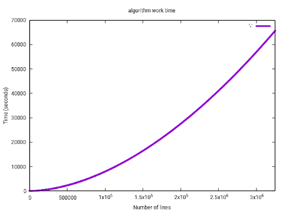
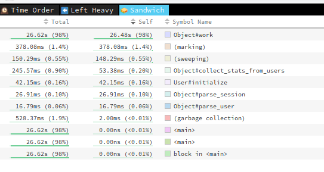

# Case-study оптимизации
## Цель
Научится использовать инструменты профилирования приложений. На основе отчетов профилировщиков провести оптимизацию скрипта обработки файла.
## Задачи
- проанализировать асимптотику алгоритма обработки файла
- сделать примерную оценку времени работы алгоритма до оптимизации
- на основе оценки времени сделать тестовый файл с необходимым количестовм строк, что бы скорость работы была не меньше секунды, а максимольное время работы приемлимым
- профилировать работающий процесс `rbspy`,
- Построить дамп `stackprof` и проанализировать его с помощью `CLI` и в `speedscope.app`
- Построить и проанализировать отчёт `ruby-prof` в режиме `Flat`
- Построить и проанализировать отчёт `ruby-prof` в режиме `Graph`
- Построить и проанализировать отчёт `ruby-prof` в режиме `CallStack`
- Построить и проанализировать отчёт `ruby-prof` в режиме `CallTree` c визуализацией в `QCachegrind`
- Постараться довести асимптотику до линейной и проверить это тестом
- Написать простой тест на время работы, что это время не превышается
- на основе отчетов оптимизировать главные точки роста и добиться времени выполнения не более 30 секунд
## Ход работы
Анализ времени работы с помощью `rspec-benchmark` показал полиномиальную асмиптотику алгоритма O(n^k). 
С помощью `benchmark-trend` получил приближение и интерполировал на весь набор данных. 
Как видно на графикке, полное время работы неоптимизированного алгоритма на тестовом файле размером в 3250940 строк,
будет примерно 20 часов  

 

**Рис. 1** Аппроксимация времени работы алгоритма

 
**Рис. 2** Первоначальная точка роста неоптимизированного алгоритма

1. Профилирование всеми инструментами показывает, что основная точка роста неоптимизированнного алгоритма находиться в методе `work`. Основное время работы приходиться на `Array#select`
Так как в методе `work` много мест, в которых происходит работа с массивами, часть кода перенес в именнованные методы, которые затем легче отслеживать в отчетах.
Убрав повторные `split()`-ы и неоптимальное добавление в массив, скорость работы увеличилась в 36 раз
2. Отключение `GC` дает прирост в производительсноти на 30% и стабилизирует считываемые метрики.
3. Из инструментов мне показался более удобным `ruby-pro` в связке с `Qcachegrind`.
Дальнейший анализ отчета указал на метод обрабатывающий сессии пользователей. Оптимизация этой части кода дала прирост на 30%
4. Еще 50% прироста скорости произошло после удаления повторных `typecast`-ов при подсчете статистки.
5. Использование структур вместо хешей дало прирост на 20%
6. Преобразования даты и парсинг в `Date` весьма ресурсоемки.
 Анализ кода показал отсутствие необходимости в преобразованиии строки в дату и обратно в строку. 
 В результате скорость обработк увелилисаь на еще на 40% по сравнению с предидущими изменениями
7. После предидущих изменений основная точка роста сдвинулась в стоону расчета статистики. 
  Использование строк вместо символов является не оптимальным при работе с хэшами. 
   использование символов в качестве ключей и изменение данных непосредственно в итоговом хэше дало прирост в производительности алгоритма на 20%
8. Мемоизация подсчета уникадьных браузеров и сортировка уникальных значений, вместо выбора уникальных из отсортированных значений дало небольшой прирост в 10%
9. Так же много времени занимает создание хэша. Предварительная инициализация хэша для репорта, и изменение данных непосредственно в итоговом хэше дало прирост в производительности алгоритма на 40%
10. Так же 10% прироста дала пердварительная алоккация массива для считывания данных из файла.
11. Для записи в `json` лучше использовал `OJ`. Но прямое использование библиотеки прироста не дало, а только при использовании конструкции вида
`File.open("result.json","w") do |f|
  f.write Oj.dump(report, mode: :compat)
  f.write "\n"
end`
12. Switch работает быстрее чем if 
13. Использование других методов для чтения файлов, т.к `IO`, `readline`, использование библиотеки CSV, 
парсинг сразу всего файла на элементы в одномерный массив, споследующей обработкой со сдвигом не давали прироста в одном случае, а вдругом ухудшали метрику.

## Результаты
Удалось добиться линейной работы алгоритма со временем работы на тестовом файле размером в 3250940 строк в 20-22 секунды.
## Защита от регрессии производительности
Для защиты от потери достигнутого прогресса при дальнейших изменениях программы был написан spec для отслеживания времени работы алгоиритма.
##Итоги
Из использованных инструментов субъективно наиболее удобным показался `ruby-prof` в связке с `QcallGrind`. При профилировании стоит на промежуточных итерациях
отключать `GC`. При разработке и рефакторинге алгоритмов существенную роль играет правильный подбор структур для хранения данных, оптимизированных методов доступа к элементам структур,
использования оптимизированных библиотек и мемоизация промежуточных результатов.
