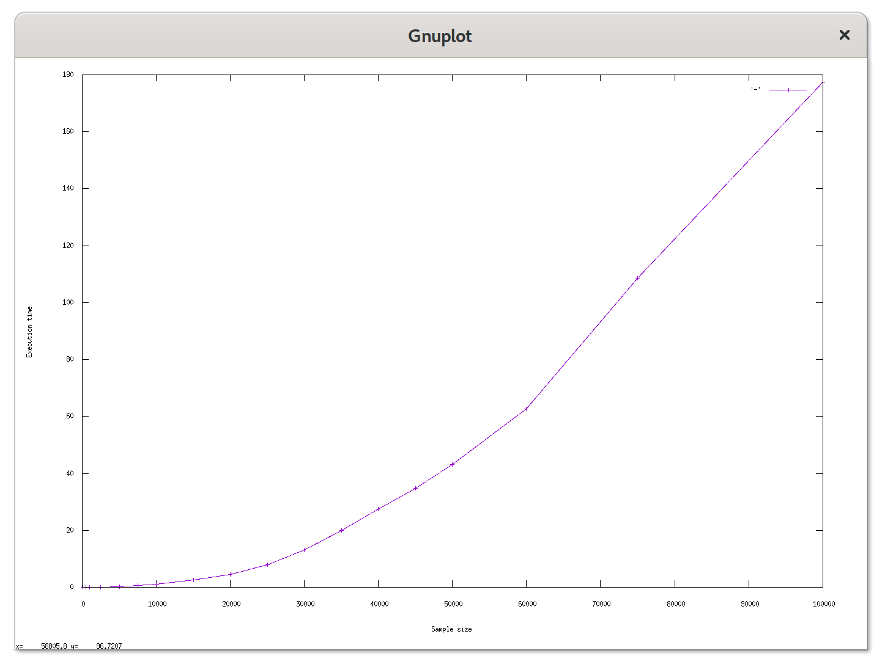
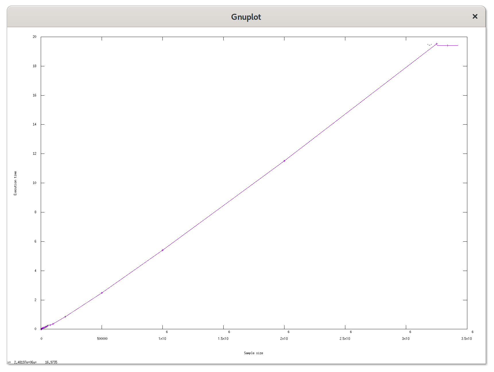

# Case-study оптимизации

## Актуальная проблема
В нашем проекте возникла серьёзная проблема.

Необходимо было обработать файл с данными, чуть больше ста мегабайт.

У нас уже была программа на `ruby`, которая умела делать нужную обработку.

Она успешно работала на файлах размером пару мегабайт, но для большого файла она работала слишком долго, и не было понятно, закончит ли она вообще работу за какое-то разумное время.

Я решил исправить эту проблему, оптимизировав эту программу.

## Формирование метрики

Для того, чтобы понимать, дают ли мои изменения положительный эффект на быстродействие программы я придумал
использовать такую метрику: время выполнения скрипта для заданного размера выборки.

Бюджет на метрику задан в условиях задачи: 30 секунд на выполнение большого файла.

## Выбор начального размера выборки и беглый анализ асимптотики

Т.к. на референсном файле скрипт вообще не завершал работу за обозримое время, я решил выбрать начальный размер
выборки (первые N строк из референсного файла) для первых шагов оптимизации. Размер выборки должен быть достаточно
большим, чтобы успешные изменения в скрипте приводили к обозримым изменениям времени выполнения, при этом время
выполнения не должно быть слишком большим (чтобы не тормозить `feedback-loop`).

Для этого я распаковал `data_large.txt.gz` в директорию `samples/`:

``` sh
$ unar data_large.txt.gz -o samples
```

Скрипт `bin/bench`, который принимает размер выборок для замера времени выполнения, генерирует при необходимости
выборки из `samples/data_large.txt` (можно было изменить метод `#work` так, чтобы он принимал
необязательным параметром размер выборки `size` и лениво читал только первые `size` строк из
`samples/data_large.txt`, но я решил не вносить лишние изменения в скрипт).

Я запустил `bin/bench` для некоторых размеров выборки:

``` sh
$ bin/bench \
    100 500 1000 2500 5000 7500 10000 15000 20000 25000 \
    30000 35000 40000 45000 50000 60000 75000 100000
```

Полученные результаты отражены в следующей таблице:

| Размер выборки | Время выполнения, сек. |
|----------------|------------------------|
| 100            | 0.0013                 |
| 500            | 0.0094                 |
| 1000           | 0.0225                 |
| 2500           | 0.0976                 |
| 5000           | 0.3210                 |
| 7500           | 0.6618                 |
| 10000          | 1.1617                 |
| 15000          | 2.6372                 |
| 20000          | 4.5404                 |
| 25000          | 8.0533                 |
| 30000          | 13.2555                |
| 35000          | 19.8822                |
| 40000          | 27.4196                |
| 45000          | 34.7722                |
| 50000          | 43.2001                |
| 60000          | 62.7231                |
| 75000          | 108.6105               |
| 100000         | 177.3695               |

Я решил выбрать 20000 в качестве изначального размера выборки, т.к. для него скрипт выполняется меньше 5 секунд, да
и число круглое.

Для визуализации данных я решил нарисовал график зависимости времени выполнения от размера выборки
с помощью скрипта `bin/plot`, который парсит вывод `bin/bench`:

``` sh
$ bin/bench ... | tee /dev/tty | bin/plot
```

Полученный график:



По данным и графику видно, что зависимость времени выполнения от размера выборки _похожа_ на квадратичную. Попробуем
оценить время выполнения оригинального скрипта для файла `samples/data_large.txt`, сравнив со временем выполнения
для размера выборки 100000:

``` sh
$ wc -l samples/data_large.txt
3250940 samples/data_large.txt
$ irb
irb(main):001:0> factor = 3250940.0 / 100000
irb(main):002:0> (factor * factor * 177.3695).round
=> 187455
```

Итого получилось ~187455 секунды, или примерно 52 часа.

## Гарантия корректности работы оптимизированной программы
Программа поставлялась с тестом. Выполнение этого теста в фидбек-лупе позволяет не допустить изменения логики программы при оптимизации.

## Feedback-Loop
Для того, чтобы иметь возможность быстро проверять гипотезы я выстроил эффективный `feedback-loop`, который позволил
мне получать обратную связь по эффективности сделанных изменений за 5-10 секунд.

Вот как я построил `feedback-loop`:

1. профилирую скрипт, чтобы выявить "точки роста"
2. вношу изменения в скрипт;
3. запускаю регрессионный тест, чтобы убедиться, что изменения не поломали код;
4. запускаю бенчмарк;
5. анализирую результаты;
6. коммит или возврат изменений.

Пункты 3-4 реализованы в скрипте `bin/feedback`.

## Вникаем в детали системы, чтобы найти главные точки роста
Для того, чтобы найти "точки роста" для оптимизации, я воспользовался следующими инструментами:

- `ruby-prof` (вызывается через скрипт `bin/ruby-prof`);
- `stack-prof` (вызывыается через скрипт `bin/stackprof`).

Я также воспользовался `rbspy` на `samples/data_large.txt`, однако на данном скрипте какой-либо полезной информации
он не показал:

```
% self  % total  name
 99.58    99.97  block in work - /home/nameless/edu/ruby-opt/rails-optimization-task1/task-1.rb
  0.50   100.00  <c function> - unknown
 [... snip ...]
```

Кроме того, я запускал `rubocop` с метриками `performance`, однако он тоже ничего полезного не предложил.

Вот какие проблемы удалось найти и решить.

### Находка №1: очень неэффективная выборка сессий пользователя

- Я построил `callgrind`-отчёт с помощью `ruby-prof` и попытался проанализировать его с помощью `kcachegrind`.

   Во разделе "Flat & Profile" сразу бросается в глаза метод `Array#select`, у в котором программа провела 96%
   времени (Self) и у которого большое число вызовов (~3000). Дальше я посмотрел вкладку "All Callers", по
   по которой видно, что большее число раз этот метод вызывался в методе `Array#each`, который в свою очередь
   больше всего вызывался из `#work`.

   В качестве точки роста я выбрал `Array#select` (я также смотрел другие отчёты `ruby-prof`, они показали примерно
   ту же информацию).

- В исходном коде только один раз встречается метод `Array#select`, а именно при выборе сессий пользователя из
   общего массива сессий. Очевидно, что время выполнения этого кода будет расти с увеличением размера данных. Но
   если бы мы заранее сформировали индекс пользовательских сессий в виде хэш-таблицы с ID пользователя в качестве
   ключа, то выбор сессий для конкретного пользователя обладало бы характеристиками получения значения в хэше
   по ключу: 0(1).

   Поэтому я решил во время обработки строк их файла формировать хэш `user_id => user_sessions`, а заодно избавился от
   массивов `users` и и `sessions`, т.к. они используется в основном для формирования массива `users_objects`, и сразу
   формировать `users_objects`. Значения `totalUsers`, `uniqueBrowsersCount`, `totalSessions`, `allBrowsers` же,
   которые тоже использовали эти массивы, можно посчитать и без них.
- Значение метрики для 20000 строк снизилось с 4.5404 секунд до 0.1924 секунд.
- В отчёте профилировщика `Array#select` перестал быть главной точкой роста.

### Находка №2: мы раз за разом итерируемся по `users_objects`
- Дальше я решил попробовать `stackprof` + `speedscope.app`. Я выяснил, что теперь значительная часть времени
   выполнения (73%) приходится на `#collect_stats_from_users`.
- `#collect_stats_from_users` вызывается из `#work` 7 раз, при этом он каждый целиком обходит массив `users_stats`.
   Очевидное решение - объединить все вызовы `#collect_stats_from_users` в один.
- Значение метрики для 20000 строк снизилось с 0.1924 секунд до 0.1605 секунд.
- Несмотря на то, что в отчетё `stackprof` метода `#collect_stats_from_users` не перестал быть главной точной роста
  (на него теперь приходится 68% времени выполнения), мы улучшили метрику, поэтому я решил оставить эти
  изменения и поискать другую точку роста с помощью `ruby-prof`.

### Находка №3: ненужный парсинг дат
- Далее я запустил `ruby-prof` с отчётом `flat` и увидел там `Date.parse` с 14.13% self и ~17000 вызовов.
- В коде `Date.parse` используется для парсинга дат, чтобы их потом отсортировать и вывести в формате ISO 8601.
   Но в исходных данных даты уже находятся в этом формате. Кроме того, строки в формате ISO 8601 можно сортировать
   в лексикографическом порядке, поэтому данный код можно заменить на сортировку строк. Также я заметил, что
   данные сначала сортируются, а потом формируется массив в обратном порядке (`#reverse`). Это можно заменить
   на вызов `#sort` с предикатом, который будет определять порядок сортировки.
- Значение метрики для 20000 строк снизилось с 0.1605 секунд до 0.0955 секунд.
- В отчёте профилировщика эта проблема перестала быть точкой роста.

### Находка №4: строки `#split`-тятся два раза

- Я снова запустил `ruby-prof` с отчётом `flat` нашёл на третьем месте `String#split` с 16.67% self и ~40000 вызовов.
- В коде я заметил, что для каждой строки `String#split` вызывается два раза: один раз в цикле `file_lines.each`,
   а второй раз в `parse_user` или `parse_session`. Решение: передавать в эти методы уже массив столбцов.
- Значение метрики для 20000 строк снизилось с 0.0955 секунд до 0.0888 секунд.
- Из отчёта профилировщика видно, что не смотря на то, что `String#split` остался на третьем месте, число его
   вызовов уменьшилось в два раза, а доля во времени выполнения с 16.67% до 10.63% self, и значение метрики снизилось.
   поэтому я решил оставить это изменение.

## Результаты
В результате проделанной оптимизации наконец удалось обработать файл с данными.

Удалось улучшить метрику системы с для размера выборки 20000 с 4.5404 секунд до 0.0888 секунд, а изначальный файл
удалось обработать за 19.5225 секунд, уложившись в заданный бюджет.

Посмотрим сейчас, как меняется время выполнения от размера выборки (добавил выборки 200000, 500000, 1000000, 2000000
и large):

| Размер выборки | Время выполнения, сек. |
|----------------|------------------------|
| 100            | 0.0005                 |
| 500            | 0.0023                 |
| 1000           | 0.0039                 |
| 2500           | 0.0142                 |
| 5000           | 0.0170                 |
| 7500           | 0.0314                 |
| 10000          | 0.0387                 |
| 15000          | 0.0598                 |
| 20000          | 0.0836                 |
| 25000          | 0.1125                 |
| 30000          | 0.1117                 |
| 35000          | 0.1453                 |
| 40000          | 0.1609                 |
| 45000          | 0.1641                 |
| 50000          | 0.2141                 |
| 60000          | 0.2573                 |
| 75000          | 0.2729                 |
| 100000         | 0.3645                 |
| 200000         | 0.8423                 |
| 500000         | 2.4717                 |
| 1000000        | 5.4025                 |
| 2000000        | 11.5239                |
| 3250940        | 19.5225                |

График:



В результате мы получили зависимость, которая _очень близка_ к линейной.

## Защита от регрессии производительности

Для защиты от потери достигнутого прогресса при дальнейших изменениях программы я написал performance-тест
с помощью гема `rspec-benchmark`, который можно вызвать следующим образом:

``` sh
$ bundle exec rspec --tag @benchmark
```
